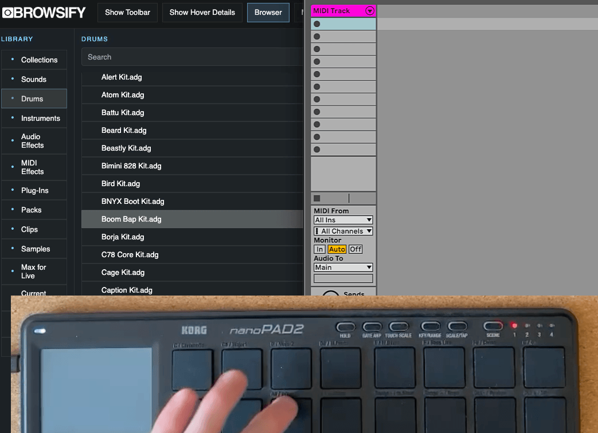
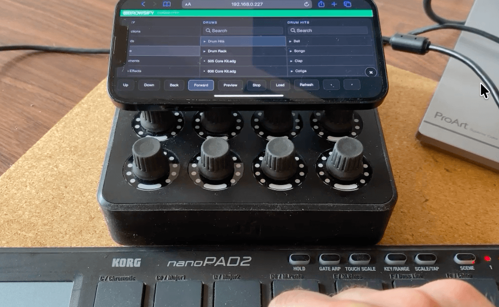
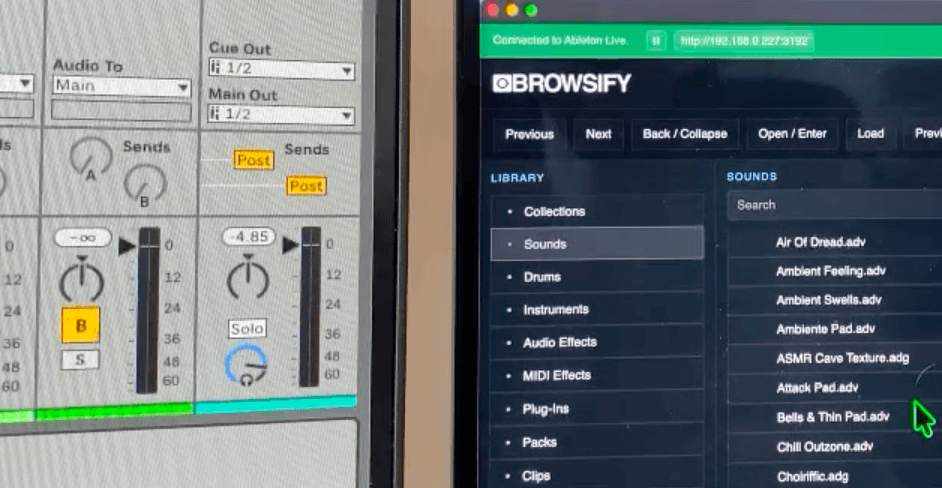
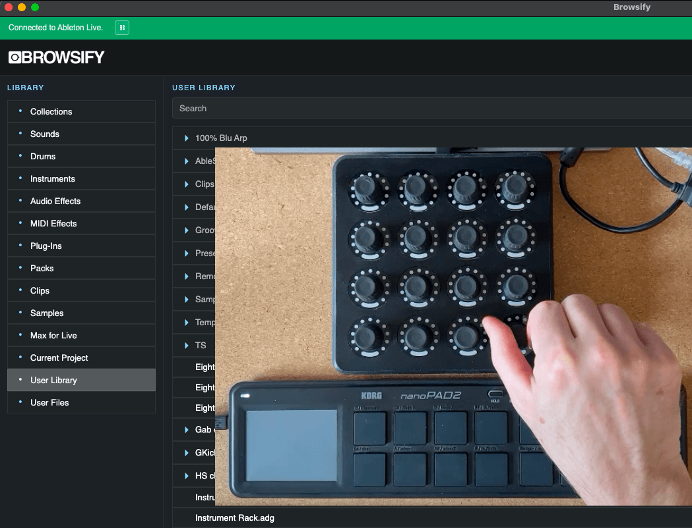

  

  MIDI-mappable browser for Ableton Live

  <strong>Navigate. Preview. Search. Load.</strong> 
  Directly from your MIDI controller.

  

---

# Browsify

Browsify is a MIDI-mappable browser for Ableton Live.

Product Page: https://remotify.io/product/browsify/

Control the Ableton Browser directly from your MIDI controller with support for:

- Navigation
- Previewing sounds
- Searching your library
- Loading devices, instruments and samples
- MIDI and keyboard shortcut control
- External display and mobile device support
  
---

# Installation

Download Browsify for your operating system. 

- **Mac Intel**  
  https://remotify.io/wp-json/remotify-analytics/v1/browsify/download/mac_intel

- **Mac Silicon (M1, M2, M3...)**  
  https://remotify.io/wp-json/remotify-analytics/v1/browsify/download/mac_silicon

- **Windows**  
  https://remotify.io/wp-json/remotify-analytics/v1/browsify/download/windows

Then follow the simple in-app setup steps

---

# Features

## Full MIDI Browser Control

Map all of the controls you need for complete MIDI control of the Ableton Browser.

Navigate, preview, search and load directly into your Ableton project — without reaching for the mouse.

---

## MIDI Search Control

Quickly jump to the search box directly from your MIDI controller for fast filtering and workflow.

---

## Flexible Navigation Modes

Navigation can be controlled using:

- Knobs
- Endless encoders
- Faders
- Buttons

Supported MIDI input types:

- Notes
- CCs
- Absolute
- Relative
- Pitch Bend

---

## Keyboard Shortcut Support

No MIDI controller?

No problem.

Browsify also supports fully customizable keyboard shortcuts.

---

## External Display Support

Put Browsify on a second screen to free up valuable space inside Ableton Live.

Perfect for:
- Touchscreen monitors
- Dedicated controller displays
- Studio side monitors

---

## Mobile & Tablet Support

No second screen available?

Use your mobile phone or tablet as a touchable Ableton Browser.

---

# Screenshots

  
  <h2>Includes controlling via a touch ready mobile phone or tablet</h2>

  
    <h2>Put Browsify on a separate screen and free up space in Ableton Live</h2>

  
  <h2>Scroll navigation with knobs and faders. Supports Endless encoders and pitch bend inputs too!</h2>

---

# Requirements

- Ableton Live 11 or 12
- macOS or Windows
- Any MIDI controller (optional)
